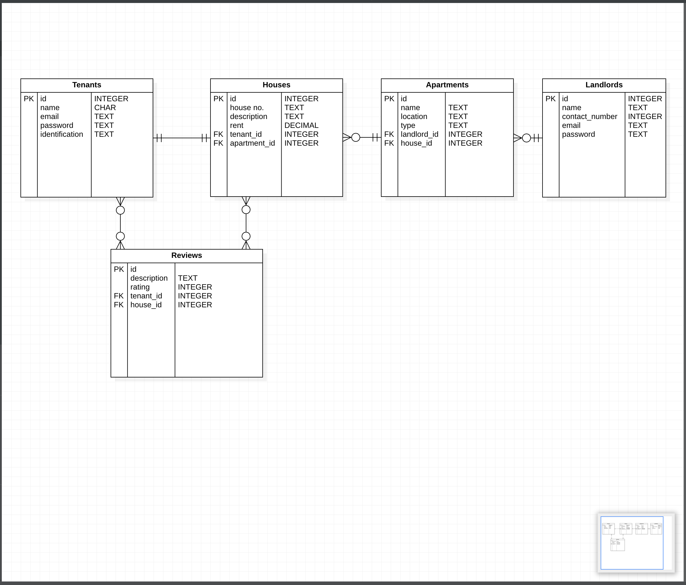

# RealState

RealState is a basic API built with Ruby rails. 

It serves as a backend API [link]()

```

```

The application has been built with the MVC design pattern.

## Pre-Requisites
In order to use this repository you will need the following:


- Operating System **(Windows `10+`, Linux `3.8+`, or MacOS X `10.7+`)**
- RAM >= 4GB
- Free Space >= 2GB

## Built With
This application has been built with the following tools:


- **Ruby `v2.7.+`**
- **SQlite3 `v1.6`**
- **ActiveRecord `v7.0.4`**
- **Rake `v13.0.6`**
- **Puma `v6.1`**
- **rerun `v0.14`**
- **Ruby on Rails `v3.0.5`**
- **Serializer `v5.3.0`**


## Setup
You can setup this repository locally by following this manual

1. Clone the repository
    ```{shell}
    git@github.com:P4-Project-G3/g23-project-backend.git
   ```
2. Ensure the ruby gems are setup in your machine
    ```{shell}
   bundle install
   ```
3. Perform any pending database migrations
   ```{shell}
   rake db:migrate
   ```
4. Run the application
    ```{shell}
    rails s
    ```
5. Open the application from your browser
    ```
   http://localhost:3000
   ```
   
## Application
This application is a simple web API that allows users to:

- View houses.
- View apartment
- View tenants
- Review a house
- Enlist an apartment


Or use the deployed [link]() directly:

```


```

### MODELS
Database schema definitions.

### ERD Diagram




#### Tenant

| COLUMN      | DATA TYPE                                       | DESCRIPTION                         | 
|-------------|-------------------------------------------------|-------------------------------------|
| id          | Integer                                         | Unique identifier.                  |
| name      | String                                          | The name of the tenant.               |
| email | String                                          | The email of the tenant. |
| password | String                                          | The password of the tenant. |
| updated_at     | Date      | The date the hero was updated.        |
| created_at   | Date                                            | The date hero was created.      |


#### Landlord

| COLUMN      | DATA TYPE                                       | DESCRIPTION                         | 
|-------------|-------------------------------------------------|-------------------------------------|
| id          | Integer                                         | Unique identifier.                  |
| name      | String                                          | The name of the landlord.               |
| contact_number | Integer                                          | The email of the landlord. |
| email | String                                          | The email of the landlord. |
| password | String                                          | The password of the landlord. |
| updated_at     | Date      | The date the hero was updated.        |
| created_at   | Date                                            | The date hero was created.      |


#### Review

| COLUMN        | DATA TYPE | DESCRIPTION                           | 
|---------------|-----------|---------------------------------------|
| id            | Integer   | Unique identifier.                    |
| description | String    | House description. |
| rate | Integer    | House description. |
| tenant_id | Integer    | Tenant id. |
| apartment_id | Integer    | Apartment id. |
| updated_at    | Date      | The date the power was updated.        |
| createdAt     | Date      | The date the power was created.        |


#### House

| COLUMN        | DATA TYPE | DESCRIPTION                           | 
|---------------|-----------|---------------------------------------|
| id            | Integer   | Unique identifier.                    |
| house_no     | String    | House numberr.                     |
| description | String    | House description. |
| rent | String    | House description. |
| tenant_id | Integer    | Tenant id. |
| apartment_id | Integer    | Apartment id. |
| updated_at    | Date      | The date the power was updated.        |
| createdAt     | Date      | The date the power was created.        |


### Apartment

| COLUMN        | DATA TYPE | DESCRIPTION                           | 
|---------------|-----------|---------------------------------------|
| id            | Integer   | Unique identifier.                    |
| name    | String   | Apartment name.                     |
| location    | String   | Apartment location.                     |
| type    | String   | Apartment type.                     |
| landlord_id | Integer    | landlord foreign key |
| house_id | Integer    | house foreign key |
| updated_at    | Date      | The date the it was updated.        |
| createdAt     | Date      | The date it was created.        |


### ROUTES

Routes for tenant, house, apartment, and landlord models:

- Tenants

```

    GET /tenants - returns a list of all tenants

    POST /tenants - creates a new tenant

    GET /tenants/{tenantId} - returns a specific tenant

    PUT /tenants/{tenantId} - updates a specific tenant

    DELETE /tenants/{tenantId} - deletes a specific tenant

    GET /tenants/{tenantId}/reviews - returns a list of all reviews that belong to the specified tenant

````

- Houses

```

    GET /houses - returns a list of all houses

    POST /houses - creates a new house

    GET /houses/{houseId} - returns a specific house

    PUT /houses/{houseId} - updates a specific house

    DELETE /houses/{houseId} - deletes a specific house

    GET /houses/{houseId}/reviews - returns a list of all reviews that belong to the specified house

```

- Apartments

```

    GET /apartments - returns a list of all apartments

    POST /apartments - creates a new apartment

    GET /apartments/{apartmentId} - returns a specific apartment

    PUT /apartments/{apartmentId} - updates a specific apartment

    DELETE /apartments/{apartmentId} - deletes a specific apartment

```

- Landlords

```

    GET /landlords - returns a list of all landlords

    POST /landlords - creates a new landlord

    GET /landlords/{landlordId} - returns a specific landlord

    PUT /landlords/{landlordId} - updates a specific landlord

    DELETE /landlords/{landlordId} - deletes a specific landlord

```

- Additional

```

    GET /tenants/{tenantId}/house - returns the house that belongs to the specified tenant

    GET /houses/{houseId}/tenant - returns the tenant that belongs to the specified house

    GET /apartments/{apartmentId}/houses - returns a list of all houses that belong to the specified apartment

    GET /houses/{houseId}/apartment - returns the apartment that the specified house belongs to

    GET /landlords/{landlordId}/apartments - returns a list of all apartments that belong to the specified landlord

```

- Reviews

```

    GET /reviews - returns a list of all reviews

    POST /reviews - creates a new review

    GET /reviews/{reviewId} - returns a specific review

    PUT /reviews/{reviewId} - updates a specific review

    DELETE /reviews/{reviewId} - deletes a specific review

    GET /reviews?houseId={houseId} - returns a list of all reviews that belong to the specified house

    GET /reviews?tenantId={tenantId} - returns a list of all reviews that belong to the specified tenant

```

## LICENSE

This repository is distributed under the MIT License

```markdown
Copyright 2023 

Permission is hereby granted, free of charge, to any person obtaining a copy of this software and associated documentation files (the “Software”), 
to deal in the Software without restriction, including without limitation the rights to use, copy, modify, merge, publish, distribute, sublicense, and/or sell copies of the Software, 
and to permit persons to whom the Software is furnished to do so, subject to the following conditions:

The above copyright notice and this permission notice shall be included in all copies or substantial portions of the Software.

THE SOFTWARE IS PROVIDED “AS IS”, WITHOUT WARRANTY OF ANY KIND, EXPRESS OR IMPLIED, INCLUDING BUT NOT LIMITED TO THE WARRANTIES OF MERCHANTABILITY, FITNESS FOR A PARTICULAR PURPOSE AND NONINFRINGEMENT. 
IN NO EVENT SHALL THE AUTHORS OR COPYRIGHT HOLDERS BE LIABLE FOR ANY CLAIM, DAMAGES OR OTHER LIABILITY, WHETHER IN AN ACTION OF CONTRACT, TORT OR OTHERWISE, ARISING FROM, OUT OF OR IN CONNECTION WITH THE SOFTWARE OR THE USE OR OTHER DEALINGS IN THE SOFTWARE.
```


## Author
This repository is maintained by:

- [Kimathi Njoki](https://github.com/kimathinjoki) `scram Master`
- [Joseph Mwanzia](https://github.com/JoseMwanzia)
- [Kenrick Ngetich](https://github.com/Kenrick99)
- [Khalid Ahmed](https://github.com/certihimo)


{
"name": "arrow den",
"location": "kikuyu",
"category": "residential"
}


{
  "username": "landi",
  "email": "landi@mail.com",
  "password": "landi"
}